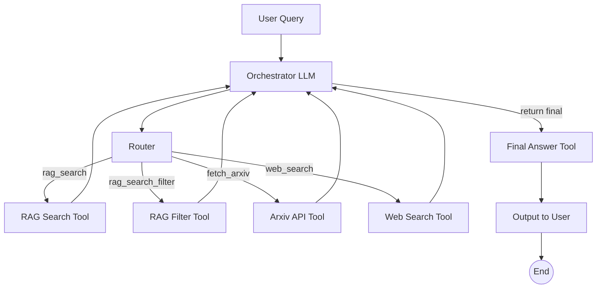
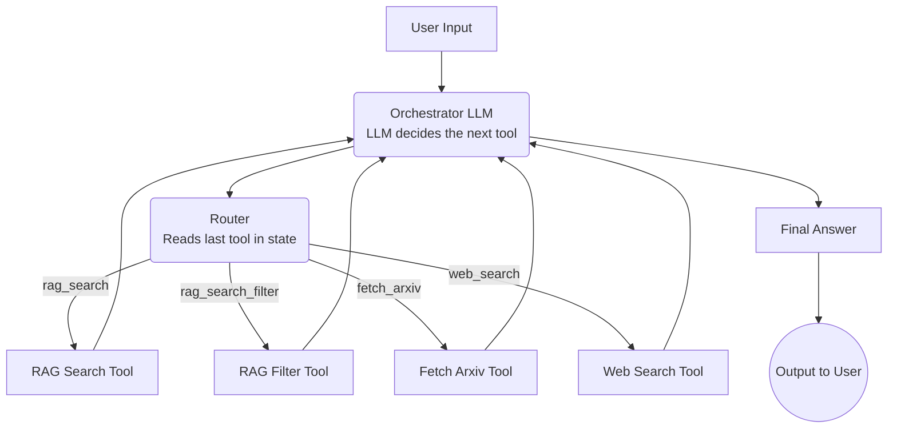

## 🚀 Agentic Research Assistant — Multi-Tool GenAI System Using LangGraph

This project implements an Agentic AI system capable of autonomous reasoning, multi-step decision-making, and retrieving information from multiple sources (RAG, Arxiv API, Web Search).
It uses LangGraph to build a state-driven agent that plans → chooses tools → observes → continues → produces a final answer.


🧠 Core Capabilities
## ✔ Agentic Reasoning

Orchestrator LLM decides the next action.

Router directs the workflow based on the agent state.

Loop continues until final_answer is reached.

## ✔ Multi-Tool Integration

rag_search_filter

rag_search

fetch_arxiv

web_search

final_answer

Each tool is a callable node in the LangGraph state machine.

## ✔  Retrieval-Augmented Generation (RAG)

Embeddings & vector search pipeline.

Dynamic chunking + metadata.

Sources: Arxiv papers, Web search results, internal documents.

## ✔  Self-Monitoring State

Stores tool results, actions, and history in:

AgentState = {
    input: str
    chat_history: []
    intermediate_steps: List[(AgentAction, str)]
}

## ✔  Architecture High-Level Agent Flow



## 🧩 Tech Stack

Component	Technology
Agent Framework	LangGraph (LangChain core)
LLM	OpenAI GPT models
Vector DB	Pinecone
Retrieval	Embeddings + similarity search
Tools	Python functions wrapped with LangChain Tool
State Machine	StateGraph


##  📦 Proposed Project Structure 

(Curretly code is in one ipynb file)
```
/agent/
    ├── orchestrator.py
    ├── router.py
    ├── tools/
    │     ├── rag_search.py
    │     ├── web_search.py
    │     ├── fetch_arxiv.py
    │     └── final_answer.py
    ├── graph.py
    ├── state.py
    ├── readme.md
```

##  ▶️ How It Works

User sends query

Orchestrator LLM interprets intent

Router maps intent to tool name

Tool executes and returns observation

Observation appended to intermediate_steps

Orchestrator re-evaluates based on new state

Loop continues until final_answer

Final answer synthesized from tool outputs


##  🧪 Example Query

"Tell me something interesting about Dynamic Backtracking AI and LLMs"

Agent may autonomously choose:

fetch_arxiv

then rag_search

then final_answer


## 🏁 Expected Output

A deeply synthesized LLM-generated answer, grounded with fetched evidence from multiple sources.

Agent Data Flow Diagram



